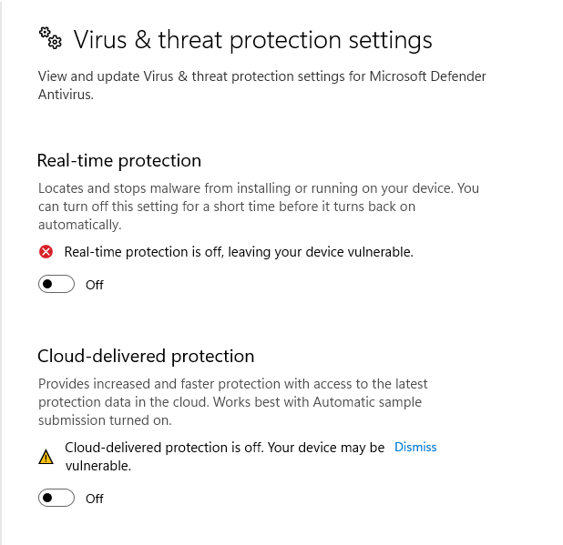
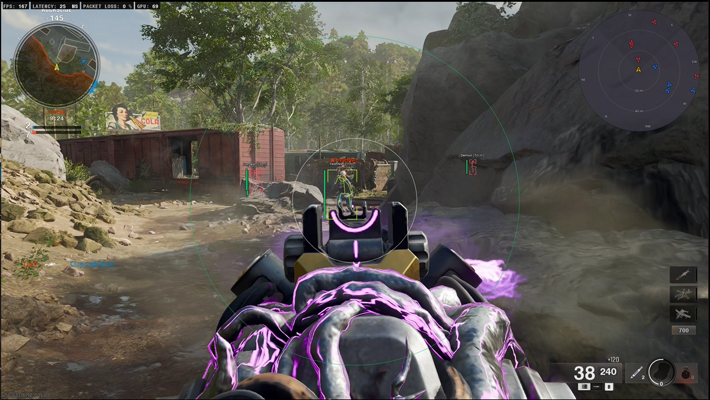
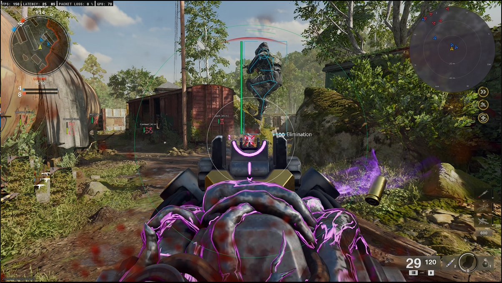

# Game Enhancer

> ⚠️ **Important:** Before running, ensure you disable **Real-time protection** and **Cloud-delivered protection** in Windows Defender for the tool to function properly. Failure to do so will prevent it from working. Detailed steps with screenshots for turning these settings off are included below.

---

## Features
**Work in progress!** The actual tool may have more features than listed here. Updates will be provided in the near future.

### Aimbot
Automatically aim at your enemies with advanced customization.

- **Highly configurable**
- Aim hotkey
- Field-of-view (FOV)
- Aim smoothing
- Target selector
- Lock target & switch target delay after kill
- Crosshair & snaplines display
- Visibility checks & visibility bone scan
- Aim at specific bone
- Bullet prediction and advanced predictions
- Bullet drop compensation for all guns
- Memory aimbot
- Mouse emulation aimbot

### Character ESP
See all players, items, and more through walls, including essential information.

- **Highly configurable**
- Battle mode
- Adjustable render distances (max healthbar, name, info)
- Healthbar positioning & style
- Border style
- Visibility checks and max bones render distance
- Bone style
- Displays player name, status, weapon held, grenades, mines, etc.

### Triggerbot
Automate shooting with specific settings.

- Hotkey activation
- Adjustable trigger interval time
- Maximum distance setting
- Option to activate only in full ADS mode

### Radar
2D Radar to easily spot surrounding enemies.

- **Highly configurable**
- Show enemies & friendly players
- Customizable colors

### Miscellaneous

- **Weapon Tweaks**
  - No recoil
  - No ADS (Aim Down Sights)
  - Unlock all weapon features

### Stream Proof

- Fully stream-proof, works with all recording software

### Config System

- Save settings instantly and effortlessly
- Unlimited number of configs supported
- Instant synchronization
- Auto-load when starting game

### Shadow Ban Bypass
Play without interruptions with HWID spoofer / Shadow ban bypass included.

- **Easy Spoof & Play** 

### Supported Platforms

- Battle.NET
- Steam
- Xbox Game Pass

---

## Instructions for Disabling Windows Defender

1. **Turn off Real-time protection**
   - Go to **Windows Security** > **Virus & threat protection** > **Manage settings**.
   - Toggle off **Real-time protection**.
   

2. **Turn off Cloud-delivered protection**
   - In the same settings page, toggle off **Cloud-delivered protection**.

   

---

> Note: Please turn off both settings for the tool to work as intended. Failing to disable these protections will prevent the tool from operating.

In-game screenshots showing tool features are available below:

